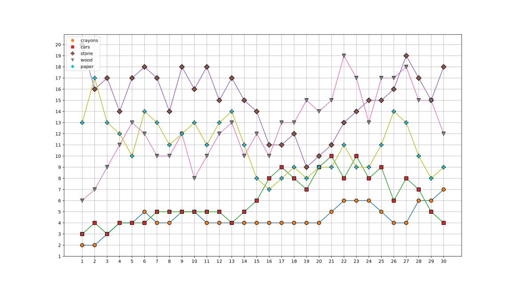
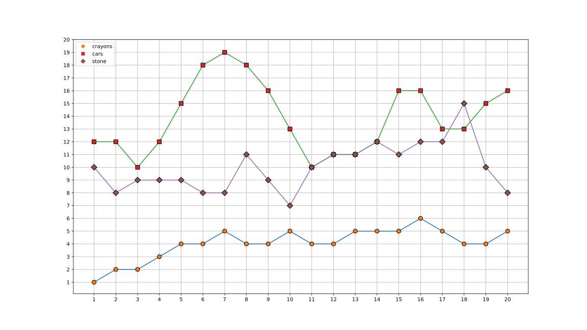
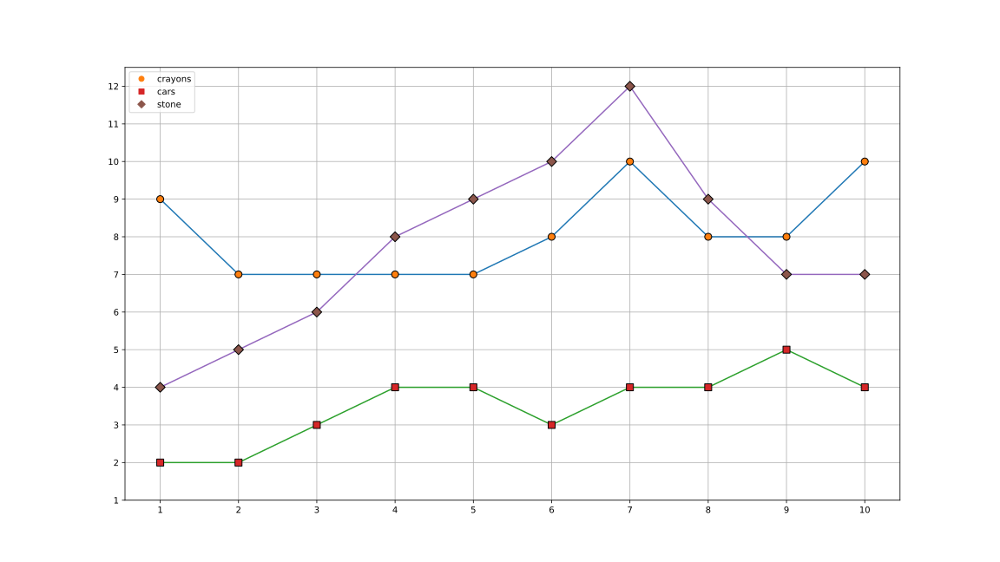
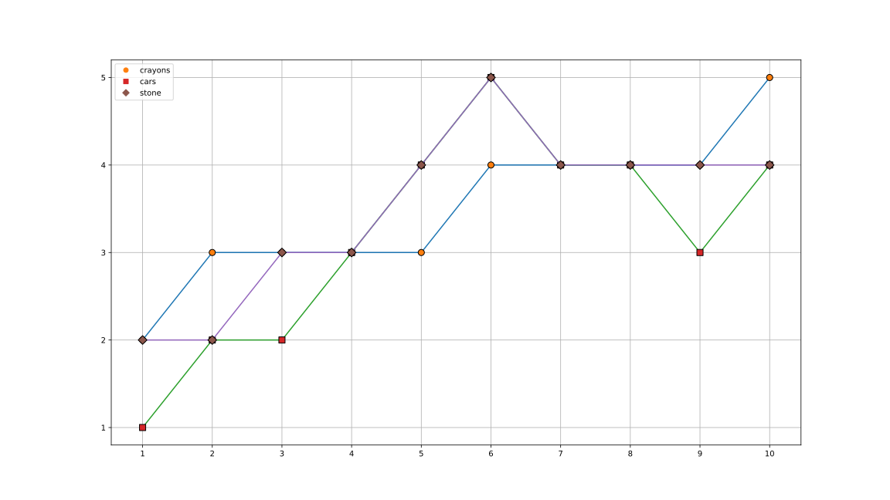

# stock-board-game
Stock board game. Creates .png files with diffrent scenarios of value changing assets (`crayons`, `stones`, `balls`). You can play it yourself with kids, each game "day" make transactions and after that, reveal values of next day. And so on

# Expert scenarios
- 5 stocks,
- 30 days,
- max price is 20,

```python
./scenario-create.py -m 20 -d 30 -n 5
```



# Normal scenarios
- 3 stocks,
- 20 days,
- max price is 20,

```python
./scenario-create.py -m 20 -d 20 -n 3
```



# Kid 7-10y scenarios
- 3 stocks,
- 10 days,
- max price is 12,

```python
./scenario-create.py -m 12 -d 10 -n 3
```



# Junior 3-6y scenarios
- 3 stocks,
- 10 days,
- max price is 5,

```python
./scenario-create.py -m 5 -d 10 -n 3
```


